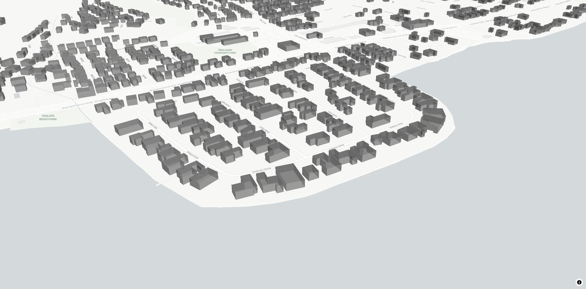

# ms-building-footprints-mbtiles-server
Vector tile server for [Microsoft's US Building Footprints](https://github.com/microsoft/USBuildingFootprints).

Downloads, converts and merges GeoJSON files into a single Mapbox tileset (using [tippecanoe](https://github.com/mapbox/tippecanoe)). Tileset is served by [mbtileserver](https://github.com/consbio/mbtileserver).

Packaged in a Docker image.



## Usage

Build (this might take a while) and run the image as a container, exposing port 8000 locally:

``docker run -p 8000:8000 $(docker build .)``

Server is accessible through port 8000 using the following URL:

``http://localhost:8080/services/Buildings/tiles/{z}/{x}/{y}.pbf``

Deck.gl example using MVTLayer:

```
...
    new MVTLayer({
        id: 'MVTLayer',
        data: [
            "http://localhost:8000/services/Buildings/tiles/{z}/{x}/{y}.pbf"
        ],
        minZoom: 0,
        maxZoom: 14,
        filled: true,
        stroked: true,
        extruded: true,
        getFillColor: [150, 150, 150, 200],
        getElevation: 10
    })
...
```